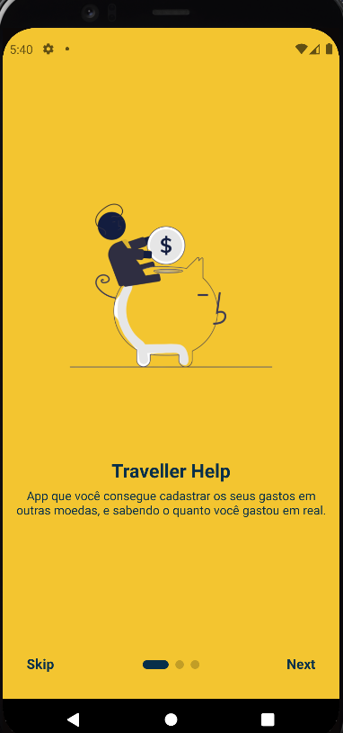
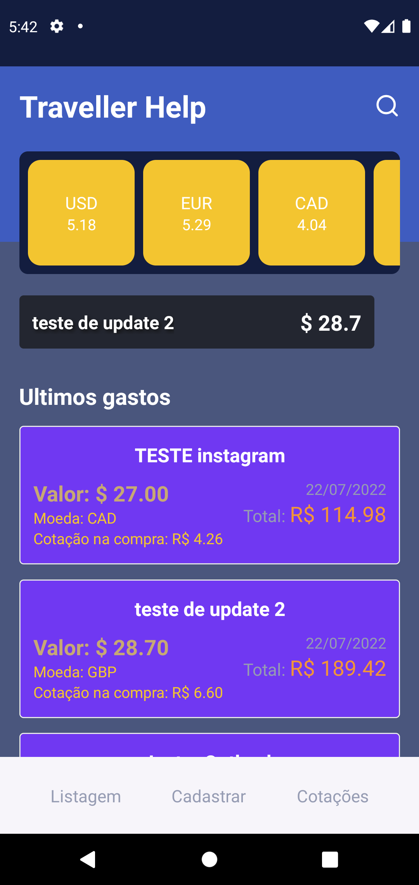

# Traveller Help

Developed by Bruno Gomes

## About the project

Traveller Help is to help users to organize their expenses. You can add your expenses in other coins and see how much you spent in reais. The frontend and backed are implemented seperately. If you want to know more about the backend you can access here: <a href="https://github.com/brunogdz/travellerhelp-api">API</a>

<p align="center">
    
</p>


## Features

- :green_circle: List the expenses sort by new to the oldest.
- :green_circle: You can favorite a currency and see it on the home screen.
- :green_circle: You can write a name for the expense. 
- :green_circle: You can search an expense by title.
- :green_circle: Calculate currency value in currency quote at the moment.
- :green_circle: Show quote values on the home screen.
- :large_blue_circle: Show graph for which spending in the month was made the most.
- :large_blue_circle: Show pie chart of spending in currencies

Description: 
- :green_circle: Feature implemented 
- :yellow_circle: Feature being implemented
- :large_blue_circle: Feature still to be implemented

## Setup

This application was made using Strapi and React Native, uses some libraries: `yarn` v.1.22.5, `expo` v.45.0.0, `axios` v.0.27.2, `date-fns` v.2.28.0 and `lottie-react-native`: v.5.1.3. 

### Configuring Database

This application uses a database to save all information related to file. You can check it on: <a href="https://github.com/brunogdz/travellerhelp-api">API</a>

### Instalation 

```sh 
git clone https://github.com/brunogdz/travellerhelp 
```

To install all packages used run in the terminal the following commands, before start you need to accredit to backend after you cloned:

```sh 
git clone https://github.com/brunogdz/travellerhelp-api
```

```sh
cd travellerhelp-api
yarn

cd travellerhelp 
yarn
```

### Starting backend server

To start backend server, run the following command in the backend repository:
```sh
yarn develop
```
This server runs in the port 8082, or you can set the port in your .env file.
You need to use develop if you want to modify something, or you can use as start, but any changes in the backend is with autoReload disabled.

### Starting frontend server

In order to showcase the frontend, run the following command in the frontend repository:  
```sh
yarn start
```
This runs in the android or ios emulator or in your cellphone.

### Usage

After install in your device it will open and you can use it.

<!-- <p align="center">
    
</p> -->

<p align="center">
    
</p>

### Meta

Bruno Gomes - @brunogdev - contact@brunogdev.com

[https://github.com/brunogdz](https://github.com/brunogdz)

## Contributing

1. Fork it (<https://github.com/brunogdz/travellerhelp>)
2. Create your feature branch (`git checkout -b feature/fooBar`)
3. Commit your changes (`git commit -am 'Add some fooBar'`)
4. Push to the branch (`git push origin feature/fooBar`)
5. Create a new Pull Request

<sub>🥶😎✌ I hope you like this project!</sub>
